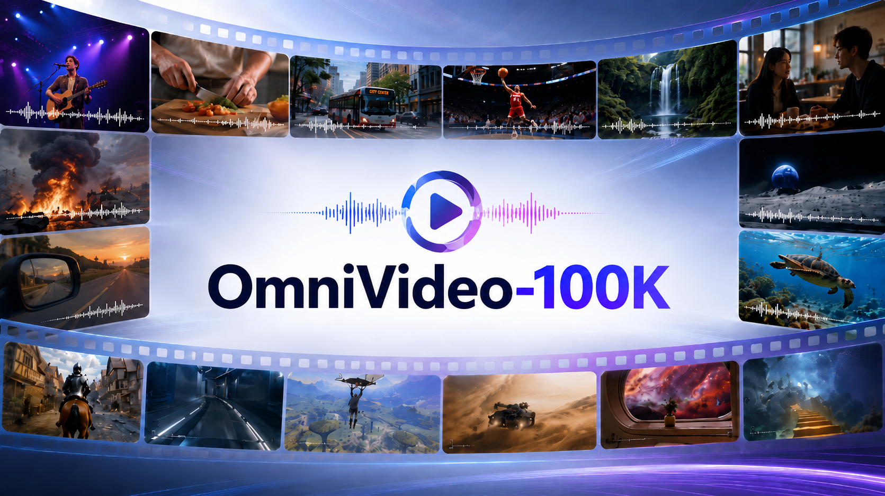

<div align="center">

# OmniVideo-100K: A Dataset for Audio-Visual Reasoning through Structured Scripts and Evidence Chains



[](https://yzlmhzz.github.io/OmniVideo-100K/)
[](https://arxiv.org/abs/2606.14702)
[](https://huggingface.co/datasets/MiG-NJU/OmniVideo-100K)
[](https://huggingface.co/datasets/MiG-NJU/OmniVideo-Test)
<br>
[-blueviolet)](https://huggingface.co/MiG-NJU/OmniVideo-7B_VITA-1.5)
[-blueviolet)](https://huggingface.co/MiG-NJU/OmniVideo-7B_Qwen2.5-Omni)
[-blueviolet)](https://huggingface.co/MiG-NJU/OmniVideo-30B_Qwen3-Omni)
</div>

This is the official repository for the paper **"OmniVideo-100K: A Dataset for Audio-Visual Reasoning through Structured Scripts and Evidence Chains"**.

---

## 🧭 Contents

- [🎬 Pipeline Overview](#pipeline-overview)
- [📦 Datasets & Models](#datasets-models)
- [📈 Performance](#performance)
- [🚀 Pipeline Quick Start](#pipeline-quick-start)
- [⭐ Training](#️training)
- [📏 Evaluation](#evaluation)
- [📚 Citation](#citation)
- [📬 Contact](#contact)

---

<a id="pipeline-overview"></a>
## 🎬 Pipeline Overview

Existing "video-caption-QA" pipelines often suffer from weak sound-source association, narrative incoherence, and locally biased QA generation. OmniVideo-100K addresses these issues with two core mechanisms:

- **Entity-Anchored Video Scripting**

    Raw videos are transformed into structured, script-like representations. Each script contains a global summary, a main entity list, segment-level speech transcripts, non-speech sounds, visual descriptions, and timestamps. Entity anchors preserve referential consistency across segments and help associate sounds with their visual sources.
- **Clue-Guided QA Generation**

    MLLMs are prompted to first mine cross-segment and cross-modal clues from the structured script, and then generate complex QA pairs grounded in these evidence chains. This encourages questions that require long-term temporal understanding and deep audio-visual dependency.


---

<a id="datasets-models"></a>
## 📦 Datasets & Models

We release **OmniVideo-100K**, an instruction-tuning dataset generated by our automated pipeline, together with **OmniVideo-Test**, a human-verified test set. We also release fine-tuned models trained on OmniVideo-100K.

The datasets cover **10 audio-visual tasks** across three cognitive levels:

- **Alignment**: Fine-Grained Perception, Scene Transformation Detection.
- **Understanding**: Context Understanding, Comparison, Sentiment Analysis, Event Sequence Ordering, Summarization.
- **Reasoning**: Causal Reasoning, Future Prediction, Hypothetical Reasoning.

For more details about the datasets and models, please refer to the links below.

| Resource                    | Description                                                  | Link                                                         |
| :-------------------------- | :----------------------------------------------------------- | :----------------------------------------------------------- |
| OmniVideo-100K              | Instruction-tuning dataset with 100K QA pairs from 5214 videos. | [🤗](https://huggingface.co/datasets/MiG-NJU/OmniVideo-100K)  |
| OmniVideo-Test              | 505-sample human-verified test set.                          | [🤗](https://huggingface.co/datasets/MiG-NJU/OmniVideo-Test)  |
| OmniVideo-7B (VITA-1.5)     | Fine-tuned VITA-1.5 model.                                   | [🤗](https://huggingface.co/MiG-NJU/OmniVideo-7B_VITA-1.5)    |
| OmniVideo-7B (Qwen2.5-Omni) | Fine-tuned Qwen2.5-Omni-7B model.                            | [🤗](https://huggingface.co/MiG-NJU/OmniVideo-7B_Qwen2.5-Omni) |
| OmniVideo-30B (Qwen3-Omni)  | Fine-tuned Qwen3-Omni-30B-A3B-Instruct model.                | [🤗](https://huggingface.co/MiG-NJU/OmniVideo-30B_Qwen3-Omni) |

---

<a id="performance"></a>
## 📈 Performance

Fine-tuning on OmniVideo-100K improves audio-visual understanding on OmniVideo-Test and generalizes to established audio-visual benchmarks.

### OmniVideo-Test

Fine-tuned models obtain overall gains of **+20.59**, **+17.82**, and **+13.86** over their corresponding base models.


### Generalization

On external benchmarks, OmniVideo-100K improves Daily-Omni, OmniVideoBench, JointAVBench, and FutureOmni while preserving general video capabilities on Video-MME.


---

<a id="pipeline-quick-start"></a>
## 🚀 Pipeline Quick Start

This section describes how to run the data synthesis pipeline on your own videos. The pipeline includes two stages: **script generation** and **QA generation**.

### Environment Setup

```bash
git clone https://github.com/MiG-NJU/OmniVideo-100K.git
cd OmniVideo-100K/data_pipeline

conda create -n omnivideo python=3.12 -y
conda activate omnivideo
conda install -c conda-forge ffmpeg
pip install tqdm aiofiles google-genai
```

### Prepare Videos

We recommend organizing your input data as follows. Here, `<root_path>` is the root directory passed to all pipeline code.

```text
<root_path>/
|-- videos/
|   `-- ori/                     # Raw input videos
`-- pre_files/
    `-- final_videos_list.jsonl  # Filtered high-quality video list
```

Each line in `final_videos_list.jsonl` should be a JSON object with at least the following fields:

```text
{
  "id": "001",                        # unique video ID
  "duration": 612,                    # video duration in seconds
  "video_path": "videos/ori/001.mp4"  # path to the raw video, relative to `<root_path>`.
}
```

### Configuration

The script-generation and QA-generation stages call MLLM APIs. Configure the following environment variables before running the pipeline:

```bash
export API_KEY="your_api_key"                          # API key for model calls
export MODEL_NAME="your_model_name"                    # model used for each step
export BASEURL_POOL="https://your-api-gateway.example" # comma-separated API base URLs
export TIMEOUT_LIMIT=300                               # request timeout in seconds
export CONCURRENCY_LIMIT=50                            # maximum concurrent requests
export QA_NUM=2                                        # QA pairs per video for each supported task
```

### Script Generation

```bash
cd gen_script

# 0. Separate audio/video and compress raw videos.
# Outputs separated audio/video files and low-resolution videos.
sh run_0.sh

# 1. Generate main entities, non-speech sounds, and speech transcripts.
# These three steps are independent and can be run in parallel if resources allow.
sh run_1.sh

# 2. Generate speaker labels, video summaries, and integrated temporal segments.
sh run_2.sh

# 3. Generate segment-level visual descriptions and check the final script file.
# The final structured script is saved to <root_path>/script.jsonl.
sh run_3.sh
```

**`script.jsonl` common fields include:**

| Field           | Description                                              |
| --------------- | -------------------------------------------------------- |
| `id`            | Video ID.                                                |
| `duration`      | Video duration.                                          |
| `video_path`    | Raw video path.                                          |
| `v_path`        | Separated video-only path.                               |
| `a_path`        | Separated audio-only path.                               |
| `low_path`      | Low-resolution video path used for API calls.            |
| `main_entities` | Main entity list.                                        |
| `transcribe`    | Raw speech transcription.                                |
| `label_speaker` | Speaker-labeled transcription.                           |
| `non_speech`    | Non-speech sound events.                                 |
| `video_summary` | Global video summary.                                    |
| `segments`      | Segment-level multimodal information.                    |
| `run_data`      | Runtime statistics such as token usage and elapsed time. |

Example segment structure:

```json
{
  "start_time": "00:00",
  "end_time": "00:15",
  "transcription": [
    {
      "start_time": "00:01",
      "end_time": "00:03",
      "text": "...",
      "speaker": "Person A"
    }
  ],
  "non_speech": [
    {
      "start_time": "00:05",
      "end_time": "00:06",
      "sound": "Laughter"
    }
  ],
  "visual": [
    {
      "start_time": "00:00",
      "end_time": "00:15",
      "text": "..."
    }
  ]
}
```

### QA Generation

**Open-Ended QA**

```bash
cd ../gen_qa

# Supported tasks:
# fine_grained_perception, scene_transformation_detection, context_understanding,
# comparison, sentiment_analysis, event_sequence_ordering, summarization,
# causal_reasoning, future_prediction, hypothetical_reasoning
# The final open-ended QA data is saved to <root_path>/<task>.jsonl.

sh generate_qa.sh
```

**Multiple-Choice QA**

For fine-grained perception, scene transformation detection, context understanding, and event sequence ordering:

```bash
# Supported tasks:
# fine_grained_perception, scene_transformation_detection,
# context_understanding, event_sequence_ordering
# The final multiple-choice QA data is saved to <root_path>/<task>_mcq.jsonl.

sh generate_mcq_1.sh
```

For other cross-segment tasks:

```bash
# Supported tasks:
# comparison, sentiment_analysis, summarization,
# causal_reasoning, future_prediction, hypothetical_reasoning
# The final multiple-choice QA data is saved to <root_path>/<task>_mcq.jsonl.

sh generate_mcq_2.sh
```

**Parsed QA files usually contain the following fields:**

| Field         | Description                                        |
| ------------- | -------------------------------------------------- |
| `id`          | Video ID.                                          |
| `question_id` | Unique question ID.                                |
| `video_path`  | Video path.                                        |
| `duration`    | Video duration.                                    |
| `task`        | Task type.                                         |
| `subtask`     | Subtask type, available for some tasks.            |
| `Q`           | Question.                                          |
| `A`           | Answer.                                            |
| `Options`     | Options for MCQ or ordering tasks.                 |
| `analysis`    | Evidence, related segments, or model analysis.     |
| `evidence`    | Explicit evidence field, available for some tasks. |
| `explanation` | Answer explanation, available for some tasks.      |

---

<a id="training"></a>
## ⭐ Training

### Prepare Data

- **OmniVideo-100K**

  You can directly use the released instruction-formatted data from [OmniVideo-100K](https://huggingface.co/datasets/MiG-NJU/OmniVideo-100K). The data format is described in [Instruction-formatted data](https://huggingface.co/datasets/MiG-NJU/OmniVideo-100K#%F0%9F%A4%96-instruction-formatted-data).

- **Your Own Data**

  If you generate QA data with the pipeline and want to fine-tune on it, you can use [./finetune/format_data_for_llama-factory.py](https://github.com/MiG-NJU/OmniVideo-100K/blob/main/finetune/format_data_for_llama-factory.py) as a reference to convert parsed QA files into the instruction format. You may adapt it for your own generated QA files, task subsets, or data mixtures.

### Qwen-Omni Fine-Tuning

Qwen2.5-Omni and Qwen3-Omni are fine-tuned with [LLaMA-Factory](https://github.com/hiyouga/LLaMA-Factory). The related files are provided under [./finetune/llamafactory](https://github.com/MiG-NJU/OmniVideo-100K/tree/main/finetune/llamafactory).

- Follow the official LLaMA-Factory instructions to set up the environment and prepare the dataset registry.
- Replace the following files in `LLaMA-Factory/src/llamafactory/data/` with our provided versions: [mm_plugin.py](https://github.com/MiG-NJU/OmniVideo-100K/blob/main/finetune/llamafactory/mm_plugin.py) and [template.py](https://github.com/MiG-NJU/OmniVideo-100K/blob/main/finetune/llamafactory/template.py). These files include the multimodal data-loading and template changes used in our Qwen-Omni training, especially for Qwen3-Omni support.

- Check or update the fields according to your local paths in [qwen2_5omni_full_sft.yaml](https://github.com/MiG-NJU/OmniVideo-100K/blob/main/finetune/llamafactory/qwen2_5omni_full_sft.yaml) and [qwen3_omni_full_sft.yaml](https://github.com/MiG-NJU/OmniVideo-100K/blob/main/finetune/llamafactory/qwen3_omni_full_sft.yaml):

```yaml
dataset: OmniVideo-100K
dataset_dir: /path/to/your/dataset_dir
tokenized_path: /path/to/cache_or_tokenized_data
output_dir: /path/to/save/checkpoints
```

- Run [qwen.sh](https://github.com/MiG-NJU/OmniVideo-100K/blob/main/finetune/llamafactory/qwen.sh) to launch training and merge the trained weights into a complete model. Before running, update the merge-related paths:

```text
thinker_path  # path to the trained checkpoint, usually the same as output_dir
save_path     # path to save the merged full model
```

### VITA-1.5 Fine-Tuning

VITA-1.5 fine-tuning follows the official [VITA](https://github.com/VITA-MLLM/VITA) training pipeline.

- Set up the VITA environment and prepare the dataset according to the official repository.

- Update the paths and distributed training settings in [./finetune/vita.sh](https://github.com/MiG-NJU/OmniVideo-100K/blob/main/finetune/vita.sh), especially:

```bash
OUTPUT_DIR=""
```

- Run:

```bash
sh finetune/vita.sh
```

---

<a id="evaluation"></a>
## 📏 Evaluation

The evaluation code is provided in [./evaluation](https://github.com/MiG-NJU/OmniVideo-100K/tree/main/evaluation). We evaluate only samples no longer than 5 minutes. During inference, we sample 16 frames for VITA-1.5 and 64 frames for other models.

| Item                 | Description                                                  |
| :------------------- | :----------------------------------------------------------- |
| Supported benchmarks | [Video-MME](https://huggingface.co/datasets/lmms-lab/Video-MME), [Video-MME-v2](https://huggingface.co/datasets/MME-Benchmarks/Video-MME-v2), [Daily-Omni](https://huggingface.co/datasets/liarliar/Daily-Omni), [OmniVideoBench](https://huggingface.co/datasets/NJU-LINK/OmniVideoBench), [JointAVBench](https://huggingface.co/datasets/roverx12345/jointavbench), [FutureOmni](https://huggingface.co/datasets/OpenMOSS-Team/FutureOmni), and [OmniVideo-Test](https://huggingface.co/datasets/MiG-NJU/OmniVideo-Test). |
| Supported models     | Qwen2.5-Omni, Qwen3-Omni, Uni-MoE-2.0-Omni, Video-SALMONN2_plus, omnivinci, MiniCPM-o-4_5, VITA-1.5, and Gemini. |

Note that the official JointAVBench evaluation randomly shuffles answer options at each run. For reproducible results with fixed option orders and answer indices, please run [fix_jointavbench.py](https://github.com/MiG-NJU/OmniVideo-100K/blob/main/evaluation/fix_jointavbench.py) before evaluation.

We recommend organizing each benchmark dataset as follows:

```text
<datasets_dir>/
|-- Video-MME/
|   |-- video/
|   `-- videomme/
|       `-- test-00000-of-00001.parquet
|-- Video-MME-v2/
|   |-- video/
|   `-- test.parquet
|-- Daily-Omni/
|   |-- Videos/
|   `-- qa.json
|-- OmniVideoBench/
|   |-- videos/
|   |   `-- ...
|   `-- data.parquet
|-- JointAVBench/
|   |-- videos/
|   `-- jointavbench_fixed.json
|-- FutureOmni/
|   |-- videos/
|   `-- futureomni_test.json
`-- OmniVideo-Test/
    |-- videos/
    `-- test_505.jsonl
```

- **For open-source models:**

  Before evaluating a model, please check the corresponding implementation in [models.py](https://github.com/MiG-NJU/OmniVideo-100K/blob/main/evaluation/models.py). Some models may require small code changes according to the comments.

```bash
python evaluation.py \
  --dataset omnivideo_test \
  --dataset_dir <datasets_dir>/OmniVideo-Test \
  --model_type qwen25_omni \
  --model_path MiG-NJU/OmniVideo-7B_Qwen2.5-Omni

python evaluation.py \
  --dataset omnivideo_test \
  --dataset_dir <datasets_dir>/OmniVideo-Test \
  --model_type qwen3_omni \
  --model_path MiG-NJU/OmniVideo-30B_Qwen3-Omni

python evaluation.py \
  --dataset omnivideo_test \
  --dataset_dir <datasets_dir>/OmniVideo-Test \
  --model_type vita_15_sft \
  --model_path MiG-NJU/OmniVideo-7B_VITA-1.5
```

- **For Gemini API evaluation:**

```bash
python evaluation_gemini.py \
  --dataset omnivideo_test \
  --dataset_dir <datasets_dir>/OmniVideo-Test \
  --model_name <gemini_model_name> \
  --api_key <api_key> \
  --base_url <base_url>
```

---

<a id="citation"></a>
## 📚 Citation

If you find this work useful, please cite:

```bibtex
@article{cai2026omnivideo100k,
  title={OmniVideo-100K: A Dataset for Audio-Visual Reasoning through Structured Scripts and Evidence Chains},
  author={Cai, Xinyue and Fu, Chaoyou and Zhang, Yi-Fan and He, Ran and Shan, Caifeng},
  journal={arXiv preprint arXiv:2606.14702},
  year={2026}
}
```

---

<a id="contact"></a>
## 📬 Contact

For questions or feedback, please contact Xinyue Cai at `yzlmhzz@smail.nju.edu.cn` or open an issue in this repository.